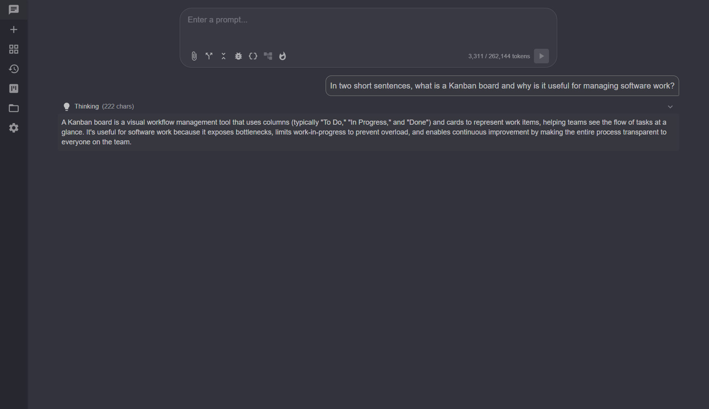

# Chat Sessions

Chat sessions are the core of yamca: a streaming conversation with a local (or
remote) LLM that can call tools to read and edit your code. The dev board runs
its work steps as seeded chat sessions, so most other features ultimately flow
through here.

## Active sessions vs. the split view

`ChatSessionManager` keeps two separate notions:

- **Active sessions** — chats loaded in memory (and possibly processing). There is
  no fixed limit; you can keep as many open as you like.
- **The visible set** — up to **4** active sessions shown as panes in the split
  grid (`ChatSessionManager.MaxPanes`), the only view in yamca.

The sidebar lists every chat in one place: active chats first (most recently
active at the top), then closed chats below the divider. An active row carries an
**X** to fully unload it; closed rows have none (deletion lives in the **History**
dialog). Clicking a chat brings it into a pane — when the grid is already full of
4, the **last** pane is replaced and the displaced chat stays active, just hidden.
A pane's header button **removes it from view** without unloading it.

Each session is bound to a workspace. A plain chat runs against the repository
itself; a board step or branch chat runs against a git worktree (see
[worktrees.md](worktrees.md)), but the session is keyed back to its base so it
reconnects to the right place.

## Naming a chat

Every chat carries a single label, computed by `ChatSessionManager.DisplayTitle`
so the title strip above the composer and the sidebar always agree. By default
the label is **derived**: the first user message (truncated), or the worktree
branch, or a `Chat N` slot number for a brand-new, unused chat.

Hovering the title strip reveals a **pencil** (or double-click the title) to
rename the chat inline. A manual name is stored as a `CustomTitle` that **wins
over the derived label everywhere** and persists with the session, so it survives
reload and shows in History. Clearing the field reverts to the derived label.

## The system message

All system-role content is concatenated into a **single system message** at
index 0 of the message log, separated by blank lines. This is for maximum
compatibility with OpenAI-compatible servers whose chat templates only honor the
first `system` role. That message is assembled at session start from:

1. The user-authored **system prompt** (from the Instructions page).
2. A **capability hint** about Markdown vs. plain-text rendering, appended
   directly after the prompt.
3. The **current workspace path**, appended automatically — you don't need to
   mention it in your prompt.
4. The bodies of any configured **instruction files** (see
   [custom-instructions.md](custom-instructions.md)).

## Picking an endpoint and model

New chats use the endpoint marked **Default**; you can pick a different endpoint
per chat from the composer. See [endpoints.md](endpoints.md).

## Reasoning models

Models that emit chain-of-thought inside `<think>`, `<thinking>`, or
`<reasoning>` tags (Qwen3, QwQ, DeepSeek-R1, etc.) are handled specially. The
**Reasoning blocks** preference controls display:

- **Hidden** — reasoning is stripped from view.
- **Collapsed** (default) — shown live while streaming, auto-closes when the
  answer begins.
- **Expanded** — always shown.

## Context and compaction

Each session tracks an estimated input-token count of its context — the
server-reported `prompt_tokens` when available, otherwise a char/4 estimate.
**Auto-compaction** (a Preferences toggle, off by default) folds older turns
into a summary inside the system message when the context grows large, so long
sessions keep working without overflowing the model's context window. A restored
session preserves the already-compacted log exactly, so the model sees the same
context it had when the chat was saved.

## Persistence

Sessions are saved under `<RepositoryRoot>/.yamca/chat` by `ChatStore`:

- Anchored on the **repository root**, so all chats — including worktree-bound
  ones — live in one place that outlives any individual worktree.
- A lightweight `index.json` backs the session list and self-heals by rescanning
  when missing or unparseable.
- Persistence is a **no-op outside a git repository**, so yamca never scatters
  local state into a non-repo folder.

## Split view

The split grid is the home view (`/`): it tiles the visible set (1–4 panes) side
by side so you can drive several chats at once — useful when running multiple
board steps in parallel. A single chat is simply a split of one. Each tile is a
full chat panel with its own header; the header's button removes the tile from
the grid (the chat stays active and reachable from the sidebar).

## See also

- [endpoints.md](endpoints.md) — configuring the LLM backends
- [tools-and-permissions.md](tools-and-permissions.md) — what the agent can do
- [custom-instructions.md](custom-instructions.md) — system prompt & instruction files
- [dev-board.md](dev-board.md) — running chats as board steps
