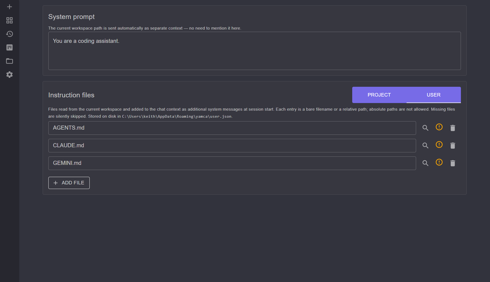

# Custom Instructions

The `/instructions` page controls the standing context the model receives at the
start of every chat session: a system prompt plus optional instruction files.
Both are folded into the single system message described in
[chat-sessions.md](chat-sessions.md).

## System prompt

A free-text **system prompt** that leads the system message. Use it for standing
guidance — coding conventions, tone, what to prioritize.

You do **not** need to mention the workspace path here; the current workspace is
sent automatically as separate context.

## Instruction files

Instruction files let you keep richer guidance in the repo itself rather than in
a settings box. Each entry names a file that is read from the current workspace
and folded into the session's single system message at session start (each under
a `# Instructions from <path>` header).

- Each entry is a **bare filename or a relative path**; absolute paths are not
  allowed.
- **Missing files are silently skipped**, so you can list optional conventions
  files without breaking sessions that don't have them.
- Files over **256 KB are silently skipped** too, so an oversized file won't
  bloat the system message.

### Project vs. User tiers

Instruction files come in two tiers:

- **Project** — stored in the project settings file, specific to this workspace
  (good for repo-specific files like a contributing guide).
- **User** — stored in the user settings file, applied across all
  workspaces.

When viewing the **Project** tier you can toggle **Inherit User instruction
files** (on by default). When on, the session loads your user instruction files
first and then the project's; turn it off to use only the project's files.

## See also

- [chat-sessions.md](chat-sessions.md) — how the system message is assembled
- [settings-and-backup.md](settings-and-backup.md) — Project vs. User settings tiers
