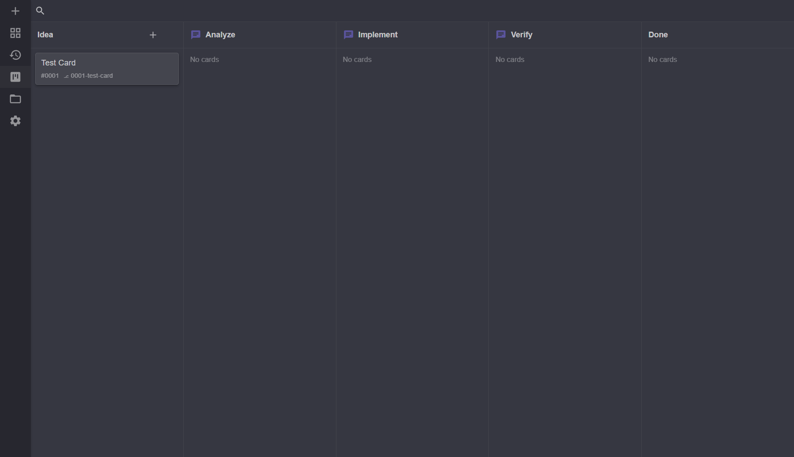

# Dev Board

The dev board is a Kanban-style board for driving development work through a
pipeline of AI-assisted steps. It lives at `/board` in the web UI.

## Where the board lives

The board is a personal scratchpad — local, **uncommitted** state for the current
user's immediate work. It is stored in `.yamca/yamca.db`, a single
[VestPocket](https://github.com/pocketsol/VestPocket) document store (gitignored,
shared by other local yamca data), under path-like keys: each column at
`/board/column/{id}` and each card at `/board/card/{id}`. It is local only: never
committed, tracked, or pushed, so board churn is never shared with your team.

Card ids are integers starting at **1**, handed out by a monotonic counter stored
at `/board/card/last-id` (the most recently assigned id). The counter only ever
advances as cards are created — deleting a card never frees its id — so a given id
refers to at most one card. The one exception is a board **wipe-reinit** (reinit
with `wipe: true`, which clears every card): it resets the counter so the next card
starts back at 1. A non-wipe reinit keeps surviving cards and their ids.
Because the store sits at the repository root, the one board is shared across every
chat session regardless of which code branch or worktree the session is on.

## Columns

Each column has a generated, opaque **id** that is independent of its display name,
plus an order that sets its position. The default layout is
**idea → analyze → implement → verify → done**. Because the id is stable and
distinct from the name, dropping and re-adding a column produces a fresh record —
a stale id always refers to a dead column, never a quickly re-added one.

- A column whose instructions have content is a **work step**: opening or
  running a card there starts an AI chat session seeded with those
  instructions. Work columns show a chat icon in the header.
- A column with no instructions is a **resting column**: cards are
  simply promoted onward without running a step.

Edit a column's instructions via the gear icon on its header.

## Cards

A card is a stored aggregate: a title, an optional priority and branch, the id of
the column it currently lives in, a markdown body, and its subtasks (each with its
own done-state). Moving a card just rewrites its column id; there is no file to
relocate. The board tools exchange a card as one markdown document — frontmatter
(`id`, `title`, optional `priority` and `branch`) plus the body and its `- [ ]`
checklist — so the agent-facing format is unchanged.

- **Create** — the `+` button on the first column adds a card. The new-card
  dialog includes a branch field that defaults to the id-prefixed slug of the
  title (tracking the title as you type, until you edit the branch yourself).
  Every card is therefore born with a `branch:` already decided.
- **Priority** — `high` / `normal` / `low`; cards sort high → normal → low
  within a column. High/low priority is shown on the card.
- **Subtasks** — GitHub-style `- [ ]` / `- [x]` checklist lines in the body are
  stored as the card's subtasks and render as a done/total count on the card.
- **Branch** — the card's branch names the git branch the card lives on,
  shared by all its steps. It is editable from the card detail dialog on any
  card not yet bound to a live worktree — including cards in resting columns —
  and a change is saved on close. Choosing a branch does **not** create a
  worktree; that waits for the first step run or chat opened on the card.
- **Edit** — open a card to edit its title and description inline.

## Moving cards

- **Drag and drop** a card between lanes. Moves are optimistic (the card jumps
  immediately) with the store write running in the background; a spinner overlay
  shows the in-flight work.
- **Promote** a card to the next column from the card detail dialog.

## Running a step

Opening a card in a work column shows its detail dialog with a **Run Step**
button; clicking that (or the per-card play button, which skips the dialog)
starts an AI chat session:

1. The card is bound to its branch (its `branch` is saved).
2. A code worktree is forked off the base branch (or reused/recreated if it was
   deleted or merged).
3. The card (title + body) plus the column's instructions seed the session.
4. You're navigated to the chat with the seeded prompt pre-filled and sent automatically.

The play button appears on cards in work columns when at least one endpoint is
configured. Each launched step opens as its own chat session, shown in a split
pane (see [chat-sessions.md](chat-sessions.md)).

## Branch actions

- **Open chat** — start an interactive session on the card's branch for
  follow-up work or conflict resolution. Offered for any card with a branch
  defined; the branch and its worktree are created on demand when none exists yet.

When a card's branch has a live worktree, the card detail dialog additionally
offers:

- **Merge** — merge the card's branch back into the base branch (reusing the
  standard branch-merge dialog), with optional worktree cleanup.

If the branch was merged or deleted, the card offers to run fresh instead.

## Filtering

- **Filter** (search icon) — filter cards by title, or by full card text, with
  starts-with or contains matching. An active filter shows as a chip.

Because the board is uncommitted, deleting a card is permanent — there is no
git history to recover it from.

## Changes tab

A card bound to a live worktree exposes a **Changes** tab in its detail dialog
that diffs the worktree against its branch's fork point.
