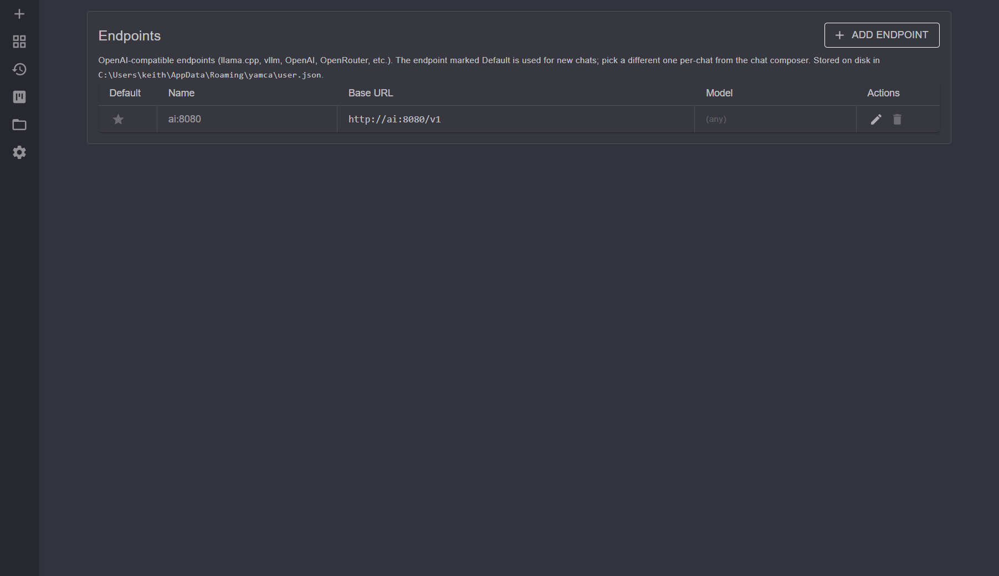

# Endpoints

An endpoint is an **OpenAI-compatible** LLM backend yamca talks to. yamca is
local-LLM first — a `BaseUrl` typically points at a llama.cpp or vllm server —
but any OpenAI-compatible API works (OpenAI, OpenRouter, etc.). Configure them at
`/endpoints`.

## Endpoint fields

| Field | Notes |
|-------|-------|
| **Id** | Stable GUID assigned on creation. Survives renames and base-URL edits so chats stay bound to the same logical endpoint across settings changes. |
| **Name** | Optional label. When blank, the UI derives one as `host · model` (or just the host). |
| **Base URL** | The OpenAI-compatible API root, e.g. `http://localhost:8080/v1`. |
| **API key** | Sent as the bearer token. Leave blank for local servers that don't check it. |
| **Model** | The model name passed to the server. |

The default new-endpoint template points at `http://localhost:8080/v1` with an
empty key and model.

## Default endpoint

One endpoint is marked **Default** and is used for every new chat. You can
override it per chat from the chat composer's endpoint dropdown. The board's
step-run dialog also lets you choose which endpoint a step runs on, defaulting to
this one.

The play button on board cards (and quick-run) only appears when at least one
endpoint is configured — without an endpoint there is nothing to run a step
against.

## Health checks

`EndpointHealthService` probes endpoints so the UI can show whether a backend is
reachable before you commit a chat to it. This catches the common local-LLM case
of a server that isn't running yet or is listening on a different port.

## Storage

Endpoints are **user** settings, stored on disk in the user settings file
(shared across all workspaces). They are included in the User settings export
(see [settings-and-backup.md](settings-and-backup.md)) — mind the API keys when
sharing an export.

## See also

- [chat-sessions.md](chat-sessions.md) — how an endpoint is selected per session
- [settings-and-backup.md](settings-and-backup.md) — user settings & export
