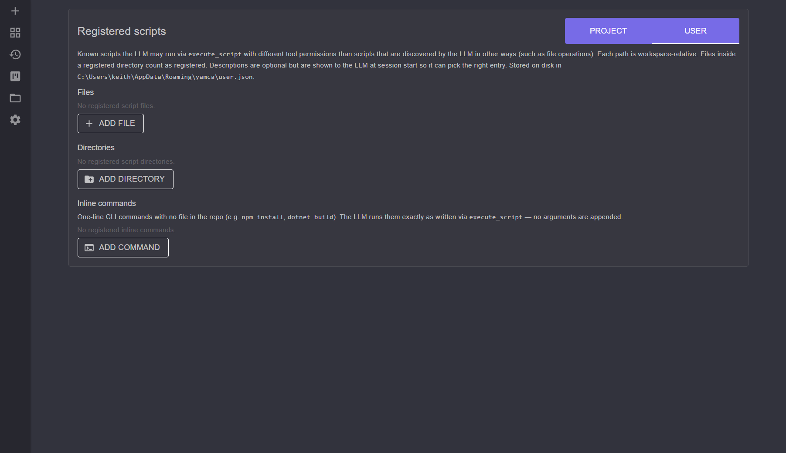

# Scripts

yamca distinguishes between scripts you **register** ahead of time and scripts the
agent **discovers** on its own, giving each a different trust level. Manage
registered scripts at `/scripts`.

## Why the distinction

A registered script is one you've explicitly told yamca about, so it can run
under different (typically looser) tool permissions than an arbitrary script the
LLM happens to find through file operations. This lets you green-light your known
build/test/lint entry points without granting blanket execution rights.

The relevant tools (see [tools-and-permissions.md](tools-and-permissions.md)):

- **`execute_script`** — the single tool the LLM actually calls to run a script by
  workspace-relative path. Internally it checks whether the path is registered and
  dispatches the permission check under one of the two names below.
- **`execute_registered_script`** — the permission identity for a known, registered
  script. Defaults to *Allow*. (Not exposed to the LLM directly.)
- **`execute_discovered_script`** — the permission identity for a script the LLM
  found by other means. Defaults to *Ask*, and the approval prompt offers to add
  the script to the registry. (Not exposed to the LLM directly.)
- **`execute_command`** — a separate tool for running an arbitrary shell command
  line (not a script file). Defaults to *Ask*.

Even though the LLM calls a single `execute_script` tool, the registered and
discovered cases carry independent permissions — e.g. you can allow registered
scripts while leaving discovered-script execution on *Ask*.

## Registering a script

The `/scripts` page registers three kinds of entry:

- **File** — a workspace-relative path that registers that single script.
- **Directory** — a workspace-relative path that registers everything inside it;
  files within a registered directory count as registered.
- **Inline command** — a one-line CLI command with no file in the repo (e.g.
  `npm install`, `dotnet build`). The LLM runs it verbatim by passing the exact
  command line as the script path; no arguments are appended.

Each entry also has:

- An optional **description**, shown to the LLM at session start so it can pick
  the right entry for a task.
- A **Hide Success** toggle: on a successful (exit 0) run, return only the status
  to the LLM and withhold stdout/stderr to save context. Failures still return
  full output.

## Project vs. User tiers

Registered scripts come in two tiers, switchable on the page:

- **Project** — stored in the project settings file, specific to this workspace.
- **User** — stored in the user settings file, available everywhere.

## Execution

Scripts run through a resolver that picks the right interpreter for the file
(`InterpreterResolver` / `ScriptRunner`), so you register the script path rather
than a full interpreter command line.

## See also

- [tools-and-permissions.md](tools-and-permissions.md) — per-tool permissions for the execute tools
- [settings-and-backup.md](settings-and-backup.md) — Project vs. User settings tiers
