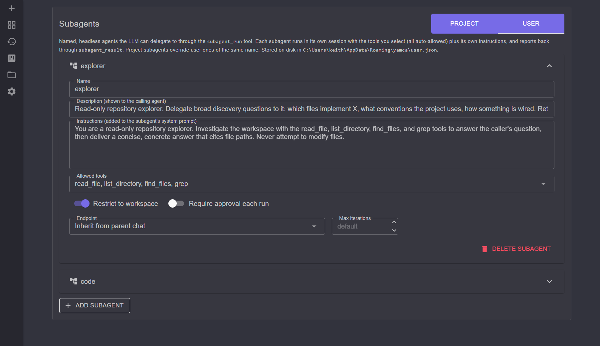
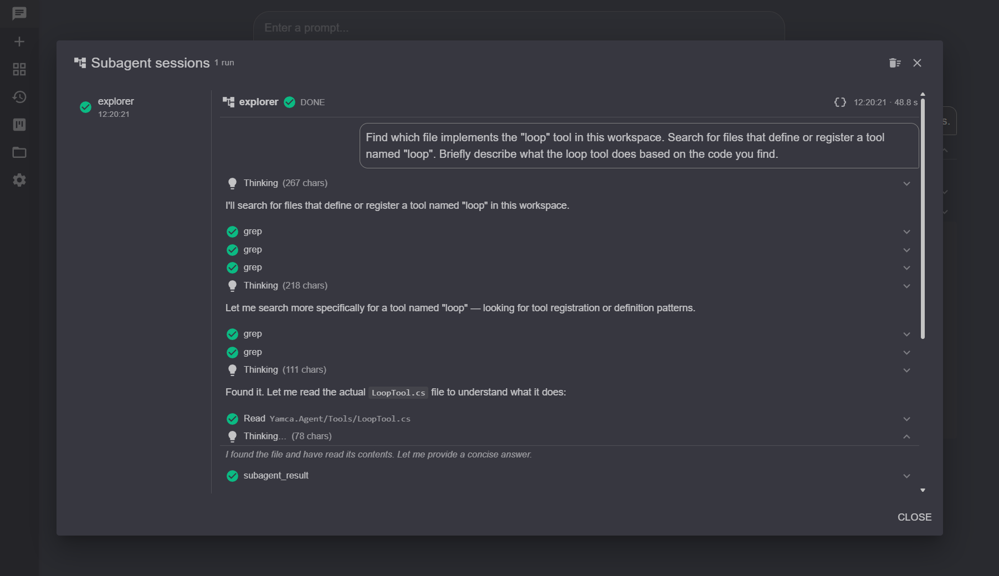

# Subagents

A subagent is a **named, headless agent** the main chat can delegate a
self-contained task to. The parent calls the `subagent_run` tool; behind that one
tool call a child session runs with its own instructions and a curated tool set,
works the task to completion, and reports back a single answer. The parent never
sees the subagent's intermediate steps — only its final result — so delegating a
context-heavy subtask (codebase exploration, search, review, research) keeps the
parent conversation's context small. Configure them at `/subagents`.

## Why delegate

The parent LLM shares one context window with everything it has already read and
done. A broad task — "which files implement X", "review this diff", "find every
call site" — can burn a lot of that window on tool output the parent doesn't need
to keep. Handing it to a subagent moves all of that churn into a throwaway
session: the subagent reads, greps, and reasons in its own context, then returns
a compact answer. The parent pays only for the question and the answer.

## Defining a subagent

Each subagent is configured per tier (**Project** or **User**, with project
entries overriding user entries of the same name) and stored on disk in the
matching settings file. A definition has:

- **Name** — the identifier the parent passes to `subagent_run` (e.g. `explorer`).
- **Description** — advertised to the parent so it knows *when* to delegate to
  this agent. The parent sees the name and description inline on the tool, so
  write it as a "use this for…" hint.
- **Instructions** — appended to the subagent's system prompt. This is where you
  shape its behavior (e.g. "read-only repository explorer… never modify files").
- **Allowed tools** — the exact set of tools the subagent may call. Every allowed
  tool is **auto-allowed** (the subagent runs headless, so there is no one to
  approve prompts). Give an explorer read-only tools; give a worker the editing
  tools it needs and nothing more.
- **Restrict to workspace** — clamps the subagent's file tools to the workspace
  sandbox, the same boundary described in [tools-and-permissions.md](tools-and-permissions.md).
- **Require approval each run** — forces a parent approval prompt every time this
  agent runs, even though `subagent_run` itself is set to Allow. Use it for an
  expensive or far-reaching agent.
- **Endpoint** — which LLM backend runs the subagent. *Inherit from parent chat*
  (the default) reuses the parent's endpoint; pick a specific one to run a cheaper
  or larger model for the delegated work. See [endpoints.md](endpoints.md).
- **Max iterations** — caps the subagent's tool-call rounds. Left blank, it uses
  the session's configured tool-iteration cap.

## How a run works

1. The parent calls `subagent_run` with an `agent` name and a complete,
   **self-contained** `prompt` — the subagent cannot see the parent
   conversation, so the prompt must carry every detail it needs.
2. A headless child session is built: the fixed headless preamble, then the
   subagent's instructions, then the allowed tools plus a private
   `subagent_result` tool.
3. The subagent works the task, then calls **`subagent_result`** exactly once
   with a `status` and its answer. That call is the only channel the parent can
   read, and it ends the run.
4. The parent receives the answer. A subagent that stops *without* delivering a
   result (it answered in prose and forgot the protocol) gets one automatic nudge
   and one more turn; if it still doesn't deliver, the run surfaces as an error
   rather than leaking confused output.

### Result status

The subagent reports one of three statuses, but **your prompt defines what they
mean** — state the success and failure criteria explicitly, and treat the
expected, nominal outcome as success (a search that finds no match is a
*successful* search, not a failure):

- **success** — the task was accomplished.
- **failure** — it could not be accomplished. This surfaces to the parent as a
  tool error, not silent prose.
- **needs_followup** — it ran fine, but this one needs another look. Returned to
  the parent as a success, tagged so the parent can spot it.

## Watching a run

When the agent delegates, a **View subagent session** affordance appears on the
`subagent_run` tool card, and the chat toolbar's **Subagent sessions** button
opens a live viewer. The viewer lists every run with its status and lets you
watch the child session's thinking, tool calls, and final result stream in real
time — the same transcript the parent will never see inlined into its own
context.

## Limits

- **No nesting.** `subagent_run` and `loop` are deliberately excluded from every
  subagent's tool set, so a subagent cannot spawn further subagents or fan out.
- **Hidden when unconfigured.** With no subagents defined, `subagent_run` (and
  `loop`) remove themselves from the parent's tool set entirely, so they never
  enter the prompt or the prefix cache.

## See also

- [loop.md](loop.md) — fan one prompt out across many items, each its own subagent
- [tools-and-permissions.md](tools-and-permissions.md) — the tools a subagent may be granted
- [endpoints.md](endpoints.md) — choosing the model a subagent runs on
- [chat-sessions.md](chat-sessions.md) — the parent conversation that delegates
