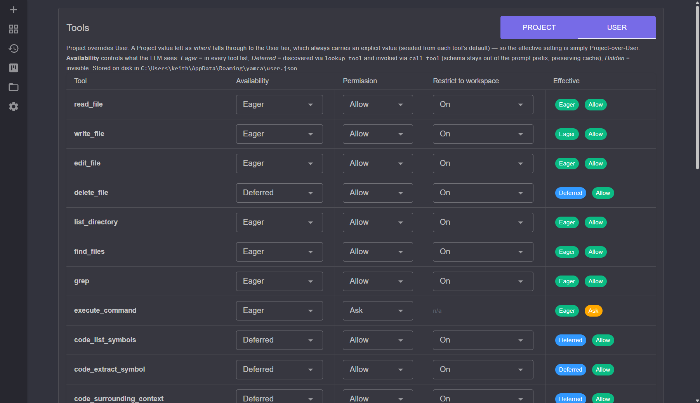

# Tools and Permissions

Tools are the actions the agent can take in your workspace — reading and writing
files, searching, running commands, and navigating code. Every tool call runs
through a **permission** check first. Configure both at `/tools`.

## Built-in tools

| Category | Tools |
|----------|-------|
| **Files** | `read_file`, `write_file`, `edit_file`, `delete_file`, `list_directory` |
| **Search** | `grep`, `find_files` |
| **Execution** | `execute_command`, `execute_allowed`, `execute_script` |
| **Background processes** | `start_process` (the LLM-facing facade); `start_process_command` (its arbitrary-command permission identity); `get_process_output`, `stop_process`, `list_processes` |
| **Git** | `git` (the LLM-facing tool); `git_read`, `git_write` (its permission identities) |
| **Code intelligence** | `code_search`, `code_list_symbols`, `code_find_definitions`, `code_find_calls`, `code_find_references`, `code_extract_symbol`, `code_edit_symbol`, `code_surrounding_context` |
| **Dev board** | `board_list`, `board_get_card`, `board_get_step_instructions`, `board_get_artifact`, `board_move_card`, `board_update_card`, `board_set_artifact`, `board_reinit` |
| **Subagents** | `subagent_run`, `loop` |
| **Tool discovery** | `lookup_tool`, `call_tool` |

The code-intelligence tools understand symbols across ~12 languages (C#, C, C++,
Java, JavaScript, TypeScript/TSX, Python, Ruby, PHP, Rust, Go, …) so the agent
can extract or edit a function/class by name instead of by line range.

[MCP servers](mcp.md) contribute additional tools beyond this built-in set.

### Execution tools

Three tools run things, with deliberately different trust levels:

- **`execute_allowed`** — runs a **pre-allowed** entry: a registered command (by name) or a
  registered script (by workspace-relative path, including a file under a registered directory).
  This is the curated allowlist path, so its permission is **fixed at Allow and not configurable** —
  greenlighting the registry is its whole purpose. It is the tool the model should reach for
  whenever a task matches something listed at session start. On a successful run its output may be
  withheld to save context (see *Hide Success* in [scripts.md](scripts.md) / [commands.md](commands.md)).
- **`execute_script`** — runs an **unregistered** script by workspace-relative path. Defaults to
  **Ask**, and the approval prompt offers to add the script to the registry (after which it runs via
  `execute_allowed`). A path that is already registered is refused and redirected to `execute_allowed`.
- **`execute_command`** — runs an **arbitrary** shell command line. Defaults to **Ask**.

If `execute_allowed` is given a string that matches both a registered command name and a registered
script path, the **command name wins**. Manage the registry at `/commands` (commands) and `/scripts`
(script files and directories); see [scripts.md](scripts.md) and [commands.md](commands.md).

### The `git` tool

The agent runs git through a single `git` tool that accepts an `operation` (a
curated subcommand) and `arguments` passed verbatim as argv. Because it spawns
`git` directly with no shell, shell metacharacters in the arguments (`;`, `&&`,
`|`, `$()`) are inert — unlike a raw `execute_command`, there is no command-line
to inject into. The model only sees this one tool; it never appears as dozens of
per-subcommand entries.

Permissions are split into two identities so reads and writes can be governed
separately:

- **`git_read`** — non-mutating subcommands (`status`, `log`, `diff`, `show`,
  `blame`). Defaults to **Allow**: these cannot change the repository no matter
  what arguments are supplied.
- **`git_write`** — mutating subcommands (`add`, `restore`, `commit`, `switch`,
  `branch`, `stash`, `fetch`, `pull`, `push`). Defaults to **Ask**.

The curated list is intentionally small — the common day-to-day subcommands. For
anything outside it (e.g. `rebase`, `reset`, `cherry-pick`), the agent falls back
to `execute_command`, or you run it yourself outside yamca.

### Background-process tools

`execute_command` runs a command to completion. The background-process tools instead
start a **long-lived** process — a dev server, watcher, or worker — and leave it running
while the chat continues:

- **`start_process`** — launches a process under the session's configured shell and returns
  immediately. The caller gives it a stable `name` (e.g. `"web"`) used by the other tools, and may
  supply a `working_directory`, an optional `stop_command`, and the `ports` it listens on. Starting a
  `name` that is already running **reuses** the existing process rather than spawning a duplicate
  (dedupe-by-name). Like the `git` tool it is a **facade**: it is not itself a settings row, but
  resolves the real permission under one of two identities depending on what it is asked to start
  (see below).
- **`get_process_output`** (default **Allow**) — reads the buffered stdout/stderr. Pass the
  `next_cursor` from a previous call as `since` to fetch only new output.
- **`stop_process`** (default **Ask**) — runs the `stop_command` if set, waits a grace
  period, then force-kills the process tree.
- **`list_processes`** (default **Allow**) — lists every process with pid, status, ports,
  and uptime.

`start_process` resolves its permission by what it is asked to launch:

- If `command` names a **registered command** (matched by its name or its exact command line),
  it runs under **`execute_allowed`** (always *Allow*) — the same green-light that governs running
  that command one-shot. Registering `npm run dev` therefore also lets the agent start it in the
  background without prompting. The registered command's name becomes the default process `name`. A
  command flagged **Background** in `/commands` is launched this way automatically when it's run via
  `execute_allowed` — so a watcher "just runs" without the model having to choose `start_process`
  (see [commands.md](commands.md)).
- Otherwise it is an **arbitrary** command, gated by **`start_process_command`** (default **Ask**) — a
  settings identity (not exposed to the LLM) distinct from `execute_command`, because a long-lived,
  OS-wide process that outlives the session is a bigger grant than a one-shot command.

Processes are **OS-wide** and owned by one process-wide manager: a process started in one
chat session keeps running after that session ends and stays visible to other sessions and
to the **Processes** sidebar page (where it can be viewed, restarted, or stopped). All
running processes are stopped gracefully when Yamca shuts down. These tools are
[deferred](#availability) by default, so their schemas never enter the prompt prefix.

## Permission levels

Each tool resolves to one of two levels (`PermissionLevel`):

- **Allow** — runs without prompting.
- **Ask** — pauses for your approval before each call.

To forbid a tool outright, you don't set a permission — you set its
[**availability**](#availability) to **Hidden**, so the model never even sees it.
That is strictly better than a "deny" permission would be: a hidden tool can't be
called, so the model never wastes a turn invoking something that could only ever be
refused. (Earlier versions had a third `Deny` permission; any setting saved with it
is migrated to Hidden on load.)

Resolution is layered: the **Project** setting wins if set, otherwise the
**User** setting applies. The User tier always carries an explicit value for
every tool — on load it's seeded from each tool's built-in `DefaultPermission`
(see [Default philosophy](#default-philosophy)) — so there's no "inherit" to
fall through at the User level. A Project setting left as *inherit* falls
through to User. So you can set a standing preference per tool across all
workspaces, then override it per project.

### Workspace restriction

File-touching tools can be restricted to the workspace sandbox. When
`RestrictToWorkspace` is on, paths are clamped to the session's `RootPath` and an
attempt to escape it is refused (`PathOutsideWorkspaceException`). This resolves
with the same Project → User → tool-default precedence.

### Default philosophy

The shipped defaults are tuned for the primary audience: developers modifying
code in a git repository, typically on a throwaway worktree branch that
segregates the agent's work. Under that assumption, the whole-file tools
`write_file` and `delete_file` default to **Allow** — but only *within the
workspace*, because workspace restriction is on by default for every
file-touching tool. The in-place edit tools (`edit_file` and `code_edit_symbol`)
default to **Ask** so you see a diff before each surgical change lands, as does
running an arbitrary shell command (`execute_command`). For everything that does
default to Allow, the safety net is the workspace boundary plus version control,
not a prompt on every write.

## Availability

Separately from permissions, **availability** controls what the LLM even *sees*:

- **Eager** — the tool's schema is in every tool list.
- **Deferred** — the tool is discovered on demand via `lookup_tool` and invoked
  via `call_tool`. Its schema stays out of the prompt prefix, which preserves
  prompt-cache hits. MCP tools are always deferred.
- **Hidden** — invisible to the model.

Like permissions, availability resolves Project over User. The User tier is
seeded with each tool's default availability, so a Project value left as
*inherit* falls through to User.

## Approval flow

When a tool resolves to **Ask**, the agent raises an approval request that
surfaces in the chat UI. You approve or reject the specific call; for edit tools
the request includes a diff so you can see the change before it lands.

## See also

- [scripts.md](scripts.md) — registering script files and directories (run via `execute_allowed`)
- [commands.md](commands.md) — registering one-line commands (run via `execute_allowed`)
- [mcp.md](mcp.md) — tools contributed by MCP servers
- [settings-and-backup.md](settings-and-backup.md) — Project vs. User settings tiers
